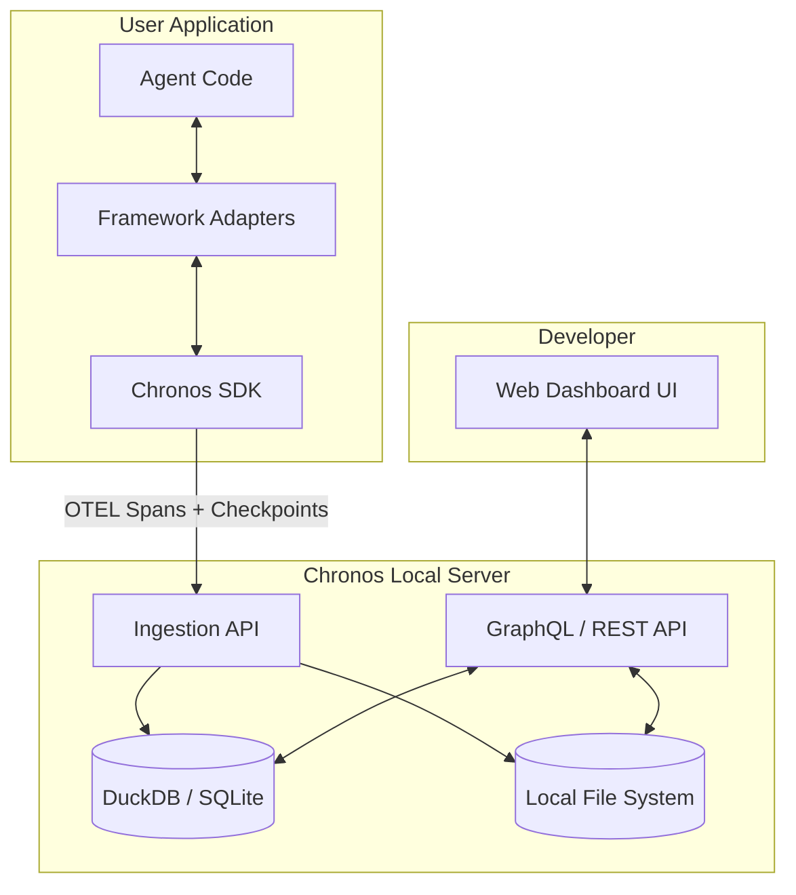

# Chronos: AI Agent Debugging & Replay Platform Architecture

This document outlines the architecture for an open-source, framework-agnostic developer platform designed for debugging, replaying, evaluating, and time-traveling AI agent executions. 

## 1. Overall Architecture (Local-First MVP)

For the MVP, we are prioritizing a **local-first architecture**. This ensures developers can run the tool entirely on their laptops without complex infrastructure.

1.  **Client Tier (SDKs):** Lightweight, framework-agnostic instrumentation running inside the user's application.
2.  **Control Plane (Local Backend):** A lightweight FastAPI/Python server that can be installed via `pip`. 
3.  **Visualization Tier (UI):** A Next.js web application (or bundled React SPA) served by the local backend.

## 2. SDK Architecture
*   **Core Tracer:** A lightweight wrapper around the standard OTEL tracer.
*   **VCR Interceptor Layer (Monkey-Patchers):** Hooks that wrap standard libraries (e.g., `requests`, `httpx`, `openai`). This acts as a VCR—in "record" mode it captures HTTP traffic, and in "replay" mode it mocks the network instantly.
*   **Determinism Module:** Overrides `random`, `uuid`, and `datetime` to use seeded values for true time-travel.
*   **Adapter Layer:** Plugins for LangChain, CrewAI, LangGraph, etc.
*   **Checkpointer:** Serializes the agent's memory and state.

## 3. Event Model
*   **Trace (Agent Execution):** Represents a single run of an agent. Traces can fork via a `parent_trace_id` when branching occurs.
*   **Spans (Steps / Actions):** `llm.generation`, `tool.execution`, `agent.reasoning`. Includes recorded `vcr_request` and `vcr_response` payloads.
*   **Events (Logs & Milestones):** Standard log lines attached to spans.
*   **Snapshots (Checkpoints):** Event payload containing the serialized state.

## 4. Storage Architecture (MVP)
1.  **Telemetry Data Warehouse (DuckDB / SQLite):** Stores traces, spans, and events. DuckDB provides fast analytical queries over local files.
2.  **Blob Storage (Local File System):** Stores large LLM inputs/outputs, VCR network cassettes, and serialized state checkpoints.

## 5. State Management & Checkpoint Model
**Hybrid Serialization Contract:**
The SDK will attempt to serialize agent state using standard `JSON` for maximum compatibility and readability. 
If an object is not JSON-serializable (e.g., a DB connection, a custom Python class), the SDK will issue a warning to the user and fall back to "magic" binary serialization using `cloudpickle`. 

## 6. Replay Engine (Time Travel & "What-If" Branching)
We utilize a **Remote Debugger Execution Model** paired with our **VCR Engine**.

**How Time-Travel Replay Works:**
1.  The developer finds a trace in the UI and clicks "Replay".
2.  The developer runs their code locally with a flag: `CHRONOS_REPLAY=session_id python main.py`.
3.  The SDK enters **Replay Mode**. Instead of executing real API calls, the VCR interceptors fetch the mocked state from the local server. The run is instant, cost-free, and perfectly deterministic.

**How "What-If" Branching Works:**
1.  Within the DevTools UI, a developer selects a specific step (e.g., a failed LLM generation) and edits the prompt payload.
2.  The SDK replays deterministically up to that specific span using VCR Mocking.
3.  At the branch point, the SDK injects the new edited prompt, disables VCR Mocking, and switches to **Live Mode** to test the change against real APIs.

## 7. One-Click Regression Tests (CI/CD)
The platform allows converting any successful trace into an automated regression test. The backend generates a standard Python `pytest` script that runs the agent from the exact starting state, mocks external API responses using the VCR cache, and asserts that the final output matches the original trace.

## 8. Plugin System
*   **Evaluator Plugins:** Run asynchronously after an execution completes.
*   **Orchestrator Plugins:** Adapters for frameworks.

## 9. UI Architecture (The DevTools)
*   **The Git-Graph View:** Shows executions and their branches.
*   **The Timeline (Flame Graph):** Shows parallel tool executions and highlights which spans were "mocked" vs "live".
*   **The Interactive Inspector:** Side-panel with inputs, outputs, and an editor allowing users to modify JSON state or prompt text to instantly hit "Branch and Replay".
*   **The Time-Travel Debugger:** Step-through interface.

## 10. Competitive Analysis: Chronos vs LangSmith

| Capability                   | LangSmith Traces | Chronos                |
| ---------------------------- | ---------------- | ---------------------- |
| Trace execution              | ✅                | ✅                      |
| LLM calls                    | ✅                | ✅                      |
| Tool execution               | ✅                | ✅                      |
| Prompt inspection            | ✅                | ✅                      |
| Latency & cost               | ✅                | ✅                      |
| Agent visualization          | ✅                | ✅                      |
| Time-travel replay           | Limited          | **Core feature**       |
| Step replay                  | Limited          | **Core feature**       |
| Deterministic debugging      | ❌                | **Yes**                |
| Replay with different models | ❌                | **Yes**                |
| Replay after prompt edits    | ❌                | **Yes**                |
| Branch execution             | ❌                | **Yes**                |
| Snapshot state               | Partial          | **Yes**                |
| Record external state        | Limited          | **Yes**                |
| Replay failures locally      | Limited          | **Yes**                |
| SDK for any framework        | Partial          | **Yes**                |
| Vendor neutral               | Mostly LangChain | **Framework agnostic** |
